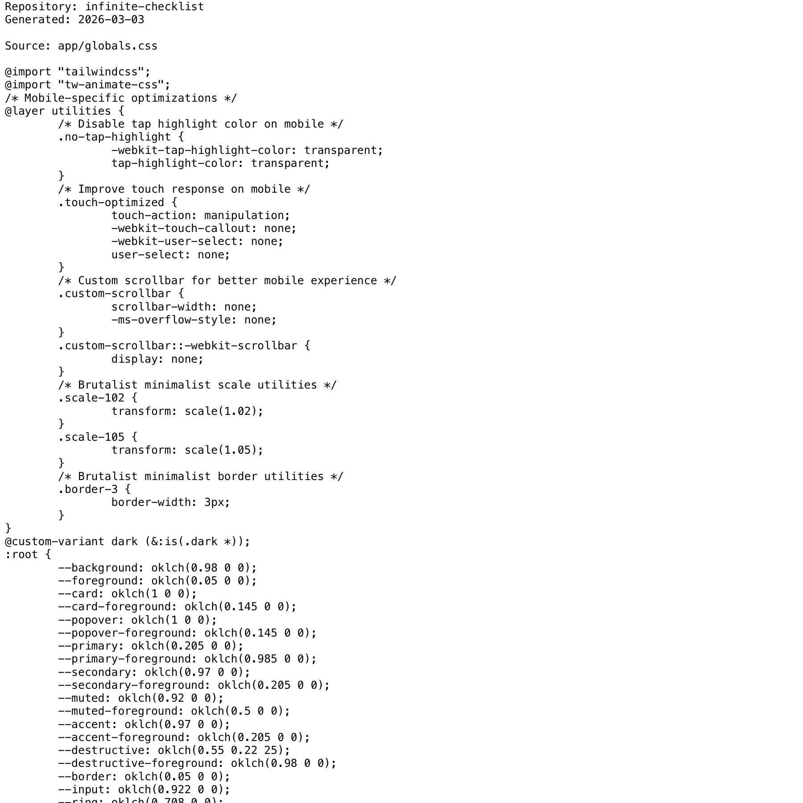

# Project Narrative & Proof

Generated: 2026-03-03

## User Journey
1. Discover the project value in the repository overview and launch instructions.
2. Run or open the build artifact for infinite-checklist and interact with the primary experience.
3. Observe output/behavior through the documented flow and visual/code evidence below.
4. Reuse or extend the project by following the repository structure and stack notes.

## Design Methodology
- Iterative implementation with working increments preserved in Git history.
- Show-don't-tell documentation style: direct assets and source excerpts instead of abstract claims.
- Traceability from concept to implementation through concrete files and modules.

## Progress
- Latest commit: f239c70 (2025-12-24) - 1.0
- Total commits: 7
- Current status: repository has baseline narrative + proof documentation and CI doc validation.

## Tech Stack
- Detected stack: Node.js, TypeScript, GitHub Actions, HTML/CSS

## Main Key Concepts
- Key module area: `app`
- Key module area: `components`
- Key module area: `lib`
- Key module area: `public`
- Key module area: `styles`

## What I'm Bringing to the Table
- End-to-end ownership: from concept framing to implementation and quality gates.
- Engineering rigor: repeatable workflows, versioned progress, and implementation-first evidence.
- Product clarity: user-centered framing with explicit journey and value articulation.

## Show Don't Tell: Screenshots


## Show Don't Tell: Code Excerpt
Source: `app/globals.css`

```css
@import "tailwindcss";
@import "tw-animate-css";
/* Mobile-specific optimizations */
@layer utilities {
        /* Disable tap highlight color on mobile */
        .no-tap-highlight {
                -webkit-tap-highlight-color: transparent;
                tap-highlight-color: transparent;
        }
        /* Improve touch response on mobile */
        .touch-optimized {
                touch-action: manipulation;
                -webkit-touch-callout: none;
                -webkit-user-select: none;
                user-select: none;
        }
        /* Custom scrollbar for better mobile experience */
        .custom-scrollbar {
                scrollbar-width: none;
                -ms-overflow-style: none;
        }
        .custom-scrollbar::-webkit-scrollbar {
                display: none;
        }
        /* Brutalist minimalist scale utilities */
        .scale-102 {
                transform: scale(1.02);
        }
        .scale-105 {
                transform: scale(1.05);
        }
        /* Brutalist minimalist border utilities */
        .border-3 {
                border-width: 3px;
        }
```
